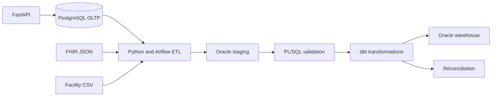

# ZambeCare Clinical Data Intelligence Platform

ZambeCare is a low-cost healthcare data engineering and DevOps portfolio project. It combines a patient-facing transactional application with an Oracle analytics warehouse, healthcare interoperability, data-quality controls, reconciliation, observability, and automated delivery.

> **Portfolio safety boundary:** This repository is for education and uses synthetic data only. It is designed to demonstrate HIPAA-aligned safeguards; it is not a certified production healthcare system and must not store real PHI.

## Phase 1 status

Phase 1 establishes the project foundation:

- FastAPI service skeleton and health endpoint
- PostgreSQL transactional database
- Oracle AI Database Free analytics target (optional Docker profile)
- Initial Oracle staging, warehouse, and audit schemas
- dbt Core project for transformations, tests, and reconciliation
- GitHub Actions continuous integration
- Jenkins deployment pipeline skeleton
- Detailed architecture, security, data-model, and roadmap documentation

See [docs/PHASE_1.md](docs/PHASE_1.md) for acceptance criteria and [docs/PROJECT_DOCUMENTATION.md](docs/PROJECT_DOCUMENTATION.md) for the full living design.

## Architecture



## Prerequisites

- Docker Engine with Docker Compose v2
- Git
- At least 4 GB free memory for the core profile
- At least 8 GB free memory when running Oracle locally

## Quick start

1. Copy the environment template:

   ```bash
   cp .env.example .env
   ```

2. Change all example passwords in `.env`.

3. Start the lightweight core services:

   ```bash
   docker compose up --build -d postgres api
   ```

4. Check the API:

   ```bash
   curl http://localhost:8000/health
   ```

5. Open API documentation at `http://localhost:8000/docs`.

## Optional Oracle profile

Oracle is deliberately placed behind a Compose profile because it needs more memory and a larger download:

```bash
docker login container-registry.oracle.com
docker compose --profile oracle up -d oracle
```

Oracle Container Registry terms may require one-time acceptance. The default service name is `FREEPDB1`.
The scripts under `db/oracle/init` are intentionally applied manually in numbered order during the Oracle setup exercise; they contain obvious placeholder passwords and are not auto-executed by Compose.

## Repository layout

```text
zambecare/
├── api/                  FastAPI service
├── db/                   PostgreSQL and Oracle database scripts
├── dbt_zambecare/        dbt transformations, tests, and reconciliation
├── docs/                 Living project documentation
├── scripts/              Developer and validation utilities
├── .github/workflows/    GitHub Actions CI
├── docker-compose.yml    Local development environment
└── Jenkinsfile           Jenkins pipeline
```

## Useful commands

```bash
make validate       # Run Phase 1 static validation
make test           # Run Python tests
make up             # Start lightweight services
make down           # Stop services
make dbt-debug      # Verify dbt-to-Oracle connectivity
make dbt-build      # Build and test dbt models
make dbt-docs       # Generate dbt documentation
```

## Delivery roadmap

| Phase | Focus |
|---|---|
| 1 | Foundation, architecture, schemas, Docker, documentation |
| 2 | Patient authentication and transactional healthcare APIs |
| 3 | Synthetic FHIR/CSV ingestion and Oracle staging pipeline |
| 4 | PL/SQL validation, batch control, restartability |
| 5 | dbt dimensional models, reconciliation, and documentation |
| 6 | AI-assisted symptom routing with medical safety rules |
| 7 | CI/CD hardening, security scanning, and release promotion |
| 8 | Monitoring, dashboards, incident simulations, interview demo |

## License

Intended for John's personal learning and portfolio use. Third-party components retain their respective licenses.
