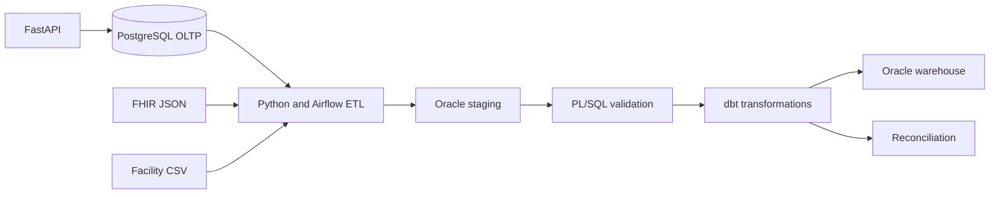

# ZambeCare Clinical Data Intelligence Platform

ZambeCare is a low-cost healthcare data engineering and DevOps portfolio project. It combines a patient-facing transactional application with an Oracle analytics warehouse, healthcare interoperability, data-quality controls, reconciliation, observability, and automated delivery.

> **Portfolio safety boundary:** This repository is for education and uses synthetic data only. It is designed to demonstrate HIPAA-aligned safeguards; it is not a certified production healthcare system and must not store real PHI.

## Current status — Phase 3

Phase 1 established the platform foundation, Phase 2 added the secure application, and
Phase 3 adds the healthcare ingestion layer:

- Secure Python/FastAPI application APIs
- Patient registration, login, profile, and logout
- Argon2 password hashing and rotating JWT sessions
- Role-based authorization and audit events
- Doctor and healthcare facility search
- Alembic database migrations
- React patient portal and dashboard
- PostgreSQL transactional database
- Oracle AI Database Free analytics target (optional Docker profile)
- Initial Oracle staging, warehouse, and audit schemas
- dbt Core project for transformations, tests, and reconciliation
- Python ingestion for PostgreSQL, FHIR JSON, and facility CSV
- Oracle Autonomous Database mTLS support and optional Airflow orchestration
- GitHub Actions continuous integration
- Jenkins deployment pipeline skeleton
- Detailed architecture, security, data-model, and roadmap documentation

See [docs/PHASE_3.md](docs/PHASE_3.md) for acceptance criteria and [docs/PROJECT_DOCUMENTATION.md](docs/PROJECT_DOCUMENTATION.md) for the full living design.

Implementation instructions:

- [Local Phase 1 implementation](docs/PHASE_1_IMPLEMENTATION.md)
- [Optional AWS EC2 implementation](docs/AWS_EC2_IMPLEMENTATION.md)
- [Phase 2 implementation and testing](docs/PHASE_2_IMPLEMENTATION.md)
- [Phase 3 manual implementation](docs/PHASE_3_IMPLEMENTATION.md)
- [Phase 3 operations runbook](docs/PHASE_3_RUNBOOK.md)
- [FHIR/source mappings](docs/FHIR_MAPPING.md)

## Architecture



## Prerequisites

- Docker Engine with Docker Compose v2
- Git
- At least 4 GB free memory for the core profile
- At least 8 GB free memory when running Oracle locally

## Quick start

1. Copy the environment template:

   ```bash
   cp .env.example .env
   ```

2. Change all example passwords in `.env`.

3. Start the lightweight core services:

   ```bash
   docker compose up --build -d postgres api frontend
   ```

4. Check the API:

   ```bash
   curl http://localhost:8000/health
   ```

5. Open the patient portal at `http://localhost:3000` and API documentation at `http://localhost:8000/docs`.

## Optional Oracle profile

Oracle is deliberately placed behind a Compose profile because it needs more memory and a larger download:

```bash
docker login container-registry.oracle.com
docker compose --profile oracle up -d oracle
```

Oracle Container Registry terms may require one-time acceptance. The default service name is `FREEPDB1`.
The scripts under `db/oracle/init` are intentionally applied manually in numbered order during the Oracle setup exercise; they contain obvious placeholder passwords and are not auto-executed by Compose.

For Oracle Autonomous Database, use the mTLS wallet workflow and scripts under
`db/oracle/cloud/`; see the Phase 3 manual. Wallet files are never committed.

## Repository layout

```text
zambecare/
├── api/                  FastAPI service
├── frontend/             React patient portal
├── db/                   PostgreSQL and Oracle database scripts
├── dbt_zambecare/        dbt transformations, tests, and reconciliation
├── ingestion/            Phase 3 Python healthcare ingestion package
├── airflow/              Optional manually triggered orchestration DAG
├── data/                 Fictional FHIR and CSV training fixtures
├── docs/                 Living project documentation
├── scripts/              Developer and validation utilities
├── .github/workflows/    GitHub Actions CI
├── docker-compose.yml    Local development environment
└── Jenkinsfile           Jenkins pipeline
```

## Useful commands

```bash
make validate       # Run Phase 1 static validation
make test           # Run Python tests
make up             # Start lightweight services
make down           # Stop services
make dbt-debug      # Verify dbt-to-Oracle connectivity
make dbt-build      # Build and test dbt models
make dbt-docs       # Generate dbt documentation
make validate-phase3 # Validate Phase 3 repository contracts
make ingestion-validate-fhir # Validate synthetic FHIR without loading
make airflow-up      # Start optional Airflow learning profile
```

## Delivery roadmap

| Phase | Focus |
|---|---|
| 1 | Foundation, architecture, schemas, Docker, documentation and implementation guides |
| 2 | Secure application APIs and React patient portal — complete |
| 3 | Synthetic FHIR/CSV ingestion and Oracle staging pipeline — implemented; live acceptance is manual |
| 4 | PL/SQL validation, batch control, restartability |
| 5 | dbt dimensional models, reconciliation, and documentation |
| 6 | AI-assisted symptom routing with medical safety rules |
| 7 | CI/CD hardening, security scanning, and release promotion |
| 8 | Monitoring, dashboards, incident simulations, interview demo |

## License

Intended for John's personal learning and portfolio use. Third-party components retain their respective licenses.
